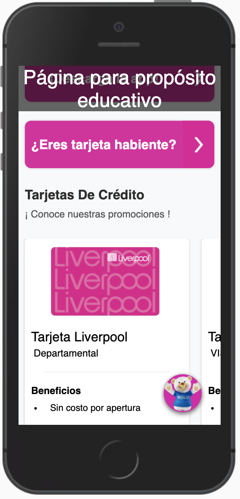

## A QR for Liverpool
A Liverpool Hackathon (Quantum HackMX 2021) challenge in which we wanted to create a web application where the customers could found all the sales offered just by using a QR code ,built with React, Redux, JavaScript, and CSS. Designed **just** for **smartphones**.

Link: https://rogecs.github.io/reto_liverpool/

### Project Screen Shots

### Installation and Setup Instructions
Clone down this repository. You will need node and npm installed globally on your machine. And being inside of the project folder in your terminal.

**Installation**

`npm install`

**To run development enviornment:**

`npm run start`

**To run production Build**

`npm run build`

**To visit the development environment:**
httpslocalhost:8080/

### Reflection

This was a 2 week long project built during Quantum HackMx 2021 by four collaborators: Francisco Ariel Arenas, Guillermo Hernandéz, Michelle Sanchéz, and Oscar Rogelio Medina. The project goals included using technologies learned in university for giving a innovative solution to the Liverpool's challenge.

One of the main challenges we ran into was the implementation between frontend and firestore, and the integration of a Dialogflow Bot in React JS. Due to project time constraints, we didn't implemented the best practices regarding security between the communication between the app and the database.

After all we learned a lot about React, firestore, git, and Github during this projects and now we feel more confident to follow knew projects and go into more depth in these technologies.

The technologies implemented in this project are React, React-Router, Redux, Dialogflow, Kommunicate, Firebase, JavaScript and CSS. We choose to create an app from scratch and using webpack to complie JavaScript modules. About the deployment aspect, we used Github pages integrated with travis-ci.org to show our website on the internet.
