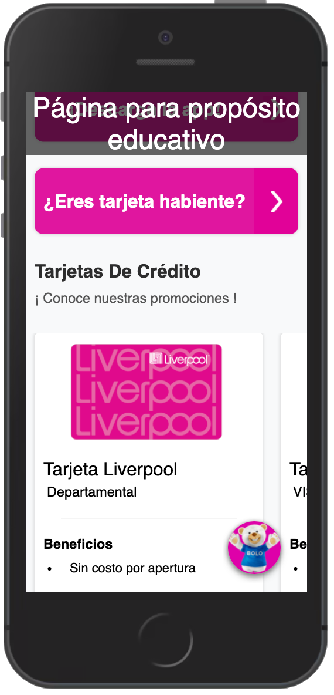
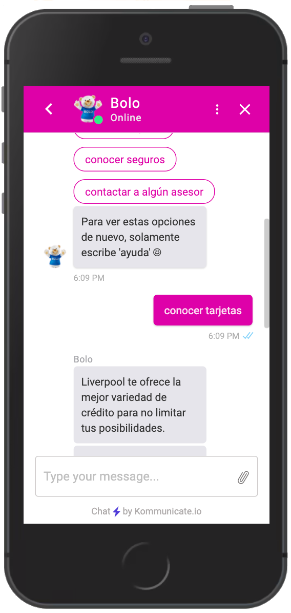

## "El Puerto de Liverpool" in a QR
A Liverpool challenge (Quantum HackMX 2021) in which we had to create a web application where customers could find all offered sales, just by using a QR code. It was built with React, Redux, JavaScript, and CSS. Designed **just** for **smartphones**.

Link: https://rogecs.github.io/reto_liverpool/

### Installation and Setup Instructions
Clone down this repository. You will need node and npm installed globally on your machine. And being inside of the project folder in your terminal.

**Installation**

`npm install`

**To run development enviornment:**

`npm run start`

**To run production Build**

`npm run build`

**To visit the development environment:**
localhost:8080/

### Reflection

This was a 2 week long project built during Quantum HackMx 2021 by four collaborators: Francisco Ariel Arenas, Guillermo Hernandéz, Michelle Sanchéz, and Oscar Rogelio Medina. The project goals included using technologies learned in university and implement them to create solution to Liverpool's challenge.

One of the main challenges we ran into was the communication between frontend and firestore, and the integration of a Dialogflow Bot in React JS. Due to project time constraints, we didn't implement the best practices regarding security on the communication between the app and the database.

After all, we learned a lot about React, firestore, git, and Github during this projects and now we feel more confident to follow new projects and go into more depth in these technologies.

The technologies implemented in this project were React, React-Router, Redux, Dialogflow, Kommunicate, Firebase, JavaScript and CSS. We chose to create an app from scratch and used webpack to complie JavaScript modules. For deployment, we used Github pages and travis-ci.org.

### More project Screen Shots

